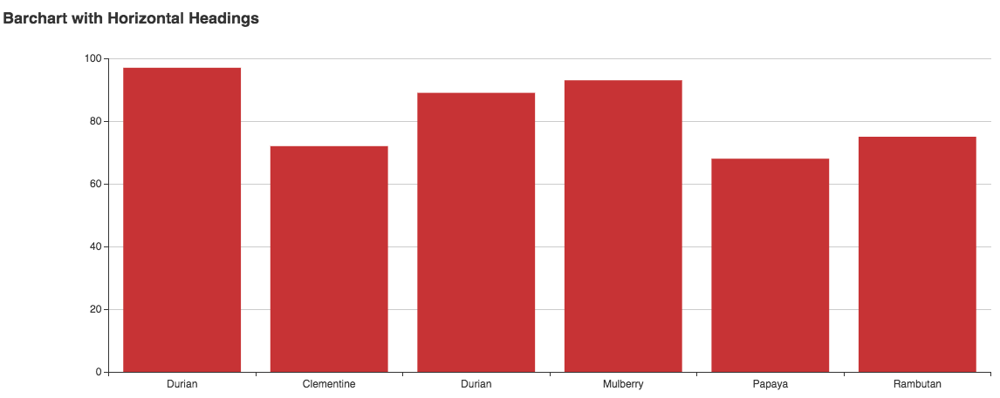
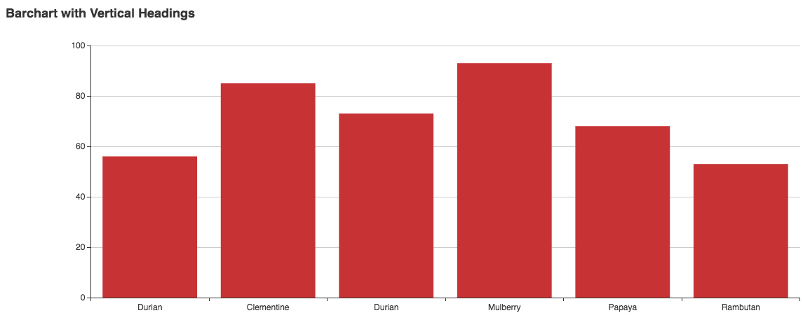
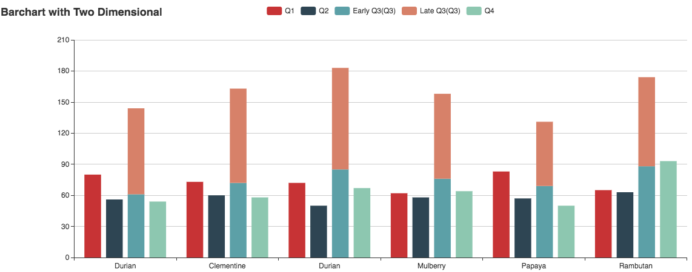
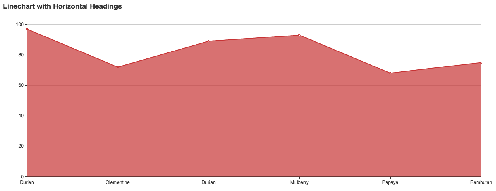
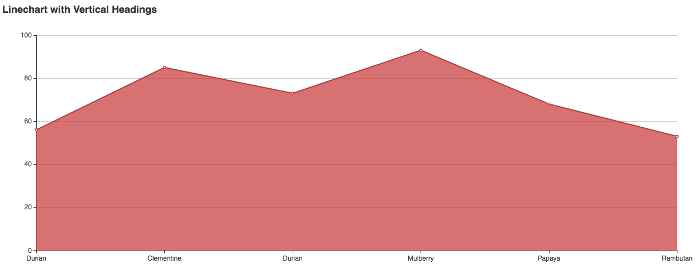
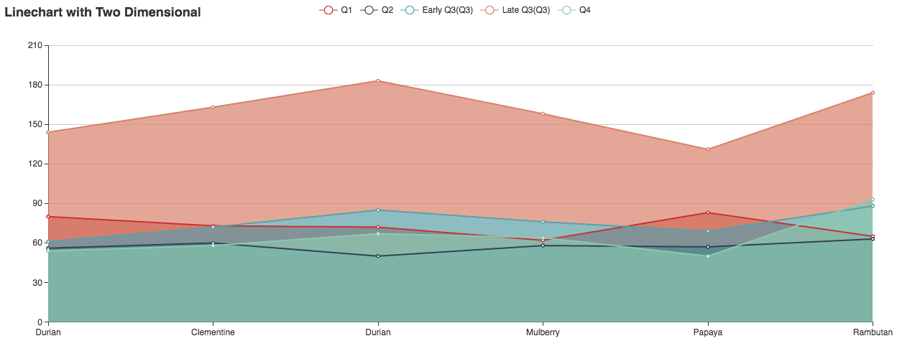

# hexo-tag-easy-charts
The easy to use chart tags for the hexo

## Installation
```
1. npm install hexo-tag-easy-charts --save
2. add following javascript file into the <head> section of layout file in the used theme
   https://unpkg.com/echarts@3.3.2/dist/echarts.min.js
```

## Barchart

### Horizontal Headings
```

Durian | Clementine | Durian | Mulberry | Papaya | Rambutan
97 | 72 | 89 | 93 | 68 | 75

```


### Vertical Headings
```

Fruit | Sales
Durian | 56
Clementine | 85
Durian | 73
Mulberry | 93
Papaya | 68
Rambutan | 53

```


### Two Dimensional
```

Quarter | Durian | Clementine | Durian | Mulberry | Papaya | Rambutan
Q1 | 80 | 73 | 72 | 62 | 83 | 65
Q2 | 56 | 60 | 50 | 58 | 57 | 63
Early Q3(Q3) | 61 | 72 | 85 | 76 | 69 | 88
Late Q3(Q3) | 83 | 91 | 98 | 82 | 62 | 86
Q4 | 54 | 58 | 67 | 64 | 50 | 93

```


Note: `Early Q3(Q3)` and `Late Q3(Q3)` will automatically combined.

## Linechart

### Horizontal Headings
```

Durian | Clementine | Durian | Mulberry | Papaya | Rambutan
97 | 72 | 89 | 93 | 68 | 75

```


### Vertical Headings
```

Fruit | Sales
Durian | 56
Clementine | 85
Durian | 73
Mulberry | 93
Papaya | 68
Rambutan | 53

```


### Two Dimensional
```

Quarter | Durian | Clementine | Durian | Mulberry | Papaya | Rambutan
Q1 | 80 | 73 | 72 | 62 | 83 | 65
Q2 | 56 | 60 | 50 | 58 | 57 | 63
Early Q3(Q3) | 61 | 72 | 85 | 76 | 69 | 88
Late Q3(Q3) | 83 | 91 | 98 | 82 | 62 | 86
Q4 | 54 | 58 | 67 | 64 | 50 | 93

```


Note: `Early Q3(Q3)` and `Late Q3(Q3)` will automatically combined.
